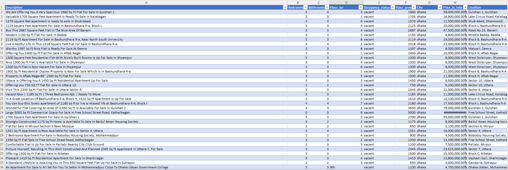
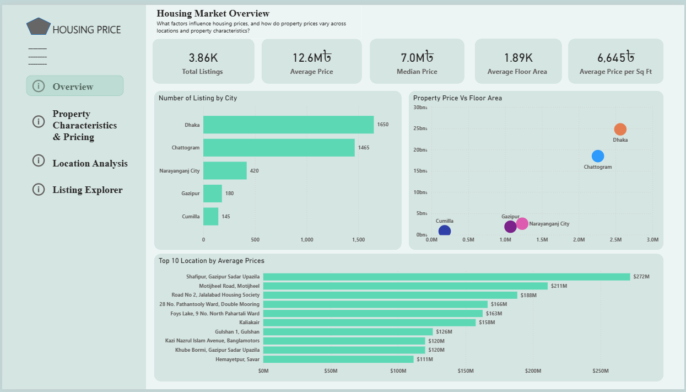
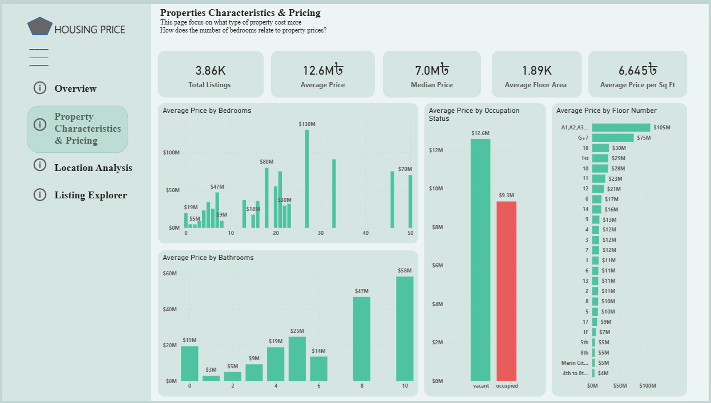
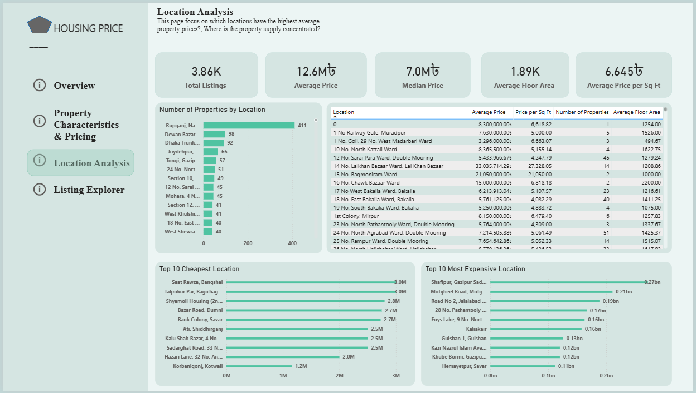
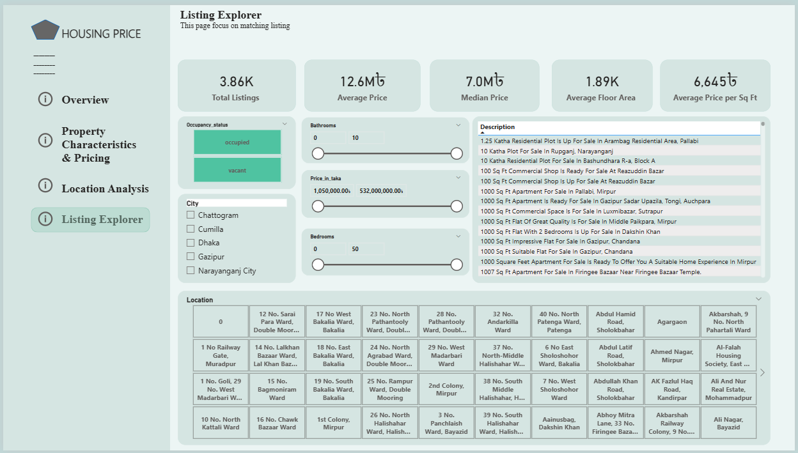

# Housing Price Analysis Dashboard
## 📌 Overview
The **Housing Price Analysis Dashboard** is an interactive Power BI
project that analyzes property prices, property characteristics, and
location-level housing patterns.

The dataset contains:
- Description
- Bedrooms
- Bathrooms
- Floor No
- Occupation Status
- Floor Area
- City
- Price in Taka
- Location

The project combines Microsoft Excel for data cleaning and
preparation with Power BI for data analysis, DAX calculations, and
dashboard development.

---

# Main Business Question
What factors influence housing prices, and how do property prices
vary across cities, locations, and property characteristics?

## Data Cleaning & Preparation in Excel

Before importing the dataset into Power BI, I used Microsoft Excel to
inspect and prepare the raw data.

## Cleaning process

- Reviewed the dataset structure and confirmed the available
fields.
- Checked for blank and missing values in important fields.
- Reviewed inconsistent entries in categorical fields such as City, Location, and Occupation Status.
- Checked numerical fields such as Bedrooms, Bathrooms, Floor No, Floor Area, and Price in Taka to ensure they were stored in suitable
formats.
- Reviewed unusual values and potential outliers, particularly property price, floor area, bedrooms, bathrooms, and floor number.
- Prepared the cleaned dataset for Power BI after the Excel review.

---

# Dashboard Pages
The report contains four main analytical pages:
- Housing Market Overview
- Property Characteristics & Pricing
- Location Analysis
- Listing Explorer

## 1. Housing Market Overview

Business Question

What does the overall housing market look like, and how do property
prices vary across cities and locations?

## Overview
The Housing Market Overview provides a high-level view of the housing market, focusing on listing volume, property prices, floor area, and location-level price differences. This page helps users understand where housing listings are concentrated and how property size and location relate to asking prices.

## Key Insights
- Dhaka has the highest number of listings, with approximately 1,650 properties, followed by Chattogram with about 1,465 listings.
- The number of listings drops considerably across the other cities, indicating that the dataset is heavily concentrated in Dhaka and Chattogram.
- Dhaka and Chattogram show substantially higher average property prices compared with the other cities in the analysis.
- The Property Price vs Floor Area analysis shows a general positive relationship between property size and price — larger properties tend to have higher asking prices.
- Some locations have exceptionally high average prices, with the highest locations exceeding ৳200M in average listing price.
- The market has a noticeable difference between the average price of ৳12.6M and median price of ৳7.0M, suggesting that high-priced properties are pulling the average upward.
### Business takeaway
The housing market is concentrated around major cities, while property size and location appear to be important factors associated with housing prices.

---

## 2. Property Characteristics & Pricing
Business Question

How do property characteristics such as bedrooms, bathrooms, floor
number, and occupation status relate to property prices?

## Overview

The Property Characteristics & Pricing page examines how property features relate to housing prices. It compares prices across bedrooms, bathrooms, floor numbers, and occupation status to identify differences in property value.

## Key Insights
- Property prices vary considerably across different bedroom categories, with some larger-bedroom properties commanding substantially higher average prices.
- The relationship between bathroom count and price is not completely linear, but properties with higher bathroom counts show some of the highest average prices.
- Vacant properties have a higher average listing price than occupied properties in this dataset — approximately ৳12.6M vs. ৳9.3M.
- Property prices vary significantly across floor numbers, although some floor categories have relatively few listings, so very high averages should be interpreted carefully.
- The presence of very high average prices for certain bedroom and floor categories suggests that outliers and differences in listing volume may influence some of the averages.
- This analysis demonstrates that property characteristics can be useful for comparing property values, but individual characteristics should not automatically be interpreted as causing higher prices.
### Business takeaway
Property characteristics are associated with substantial differences in asking prices, but the strength of the relationship varies by characteristic and should be considered alongside location and property size.

---

## 3. Location Analysis
Business Question

Which locations have the highest and lowest property prices, and
where is property supply concentrated?

## Overview
The Location Analysis page provides a detailed comparison of property supply and pricing across individual locations. It identifies locations with the highest and lowest average prices while also showing property count, average floor area, and price per square foot.

## Key Insights
- Rupganj has the highest number of properties among the locations displayed, with approximately 411 listings.
- The number of properties varies considerably between locations, with some locations having hundreds of listings while others have only a few.
- The Top 10 Cheapest Locations have average prices ranging from approximately ৳1.2M to ৳3.0M.
- The Top 10 Most Expensive Locations have substantially higher average prices, reaching approximately ৳272M in the highest location shown.
- The large gap between the cheapest and most expensive locations demonstrates significant geographic variation in property prices.
- Price per square foot also varies between locations, showing that comparing properties based only on total price may not provide the complete picture.
- The location table allows users to compare average price, price per square foot, number of properties, and average floor area simultaneously.
### Business takeaway
Location is a major differentiator in the housing market, with substantial differences in property prices and price per square foot between locations.

---

## 4. Listing Explorer
Business Question

How can individual property listings be explored based on their
characteristics and price?

## Overview
The Listing Explorer provides a detailed, property-level view of the housing dataset. Instead of focusing primarily on aggregated market trends, the page allows users to investigate individual listings and compare properties based on their location, price, size, bedrooms, bathrooms, floor number, and occupation status.

## Key Insights
The page can help users:
- Identify properties within a specific price range.
- Compare properties across different cities and locations.
- Find properties based on number of bedrooms and bathrooms.
- Compare floor areas between listings.
- Examine the difference between occupied and vacant properties.
- Investigate individual listings behind the aggregated figures shown on the other dashboard pages.
### Business takeaway
The Listing Explorer allows users to move from high-level market analysis to individual property-level investigation, making the dashboard more useful for detailed property comparison and decision-making.

---

# Key Business Questions Answered
Page Business Question:
- Housing Market Overview, What does the overall housing market look like, and how do prices vary across cities and locations?
- Property Characteristics & Pricing  How do bedrooms, bathrooms, floor number, and occupation status relate to property prices?
- Location Analysis, Which locations are the most expensive and affordable, and where is property supply concentrated?

---

# Project Workflow

Raw Housing Data → Excel Data Cleaning → Data Preparation → Power BI → DAX Measures → Interactive Dashboard → Business Insights

This project demonstrates an end-to-end data analytics workflow, from preparing raw data to presenting insights through an interactive business dashboard.

---

# 🛠️ Tools & Technologies

- Microsoft Excel
- Power BI Desktop
- Power Query
- DAX (Data Analysis Expressions)
- Data Modeling
- Interactive Visualizations

---

# 📊 Skills Demonstrated

- Data Cleaning
- Data Transformation
- Data Modeling
- DAX Measures
- KPI Design
- Dashboard Development
- Business Intelligence
- Data Visualization
- Business Analysis
- Storytelling with Data

---

## Power BI Report

The complete interactive Power BI report is included in this repository.

📥 **Download the Power BI Report**

[Housing_Price.pbix](./Housing_Price.pbix)

---

## 👨‍💻 Author

**Peter Makanjuola**

Data Analyst 

---

## ⭐ Support

If you found this project useful, consider giving it a **⭐ Star**.

